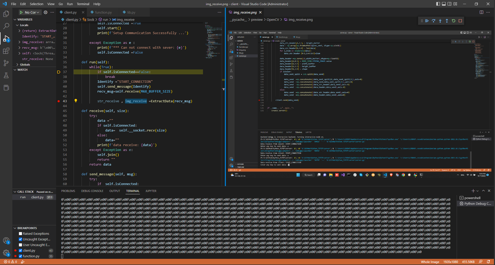

# TCP-IP-Python-Custom

<div align="center">
<p>
 
</p>
<br>  
</div>

</div>
## Introduction 
This repository contains a way send bytes through TCP/IP with type of data is Image or String or string and image.

```bash
Custom TCP/TP send and receive numpy array
- Size of buffer = (Width, Height) of screen shoot
{MODE} 
{Send_String}
        data_header[0,0:1] = MODE_SEND.STRING.value
        data_header[0,1:2] = Width of Image
        data_header[0,2:3] = Height of Image
        data_header[0,3:4] = len_str_data
        
        data_send = concat (data_header,data_convert_string_to_numpy)

{Send_Image}

        data_header[0,0:1] = MODE_SEND.IMAGE.value
        data_header[0,1:2] = Width of Image
        data_header[0,2:3] = Height of Image
        data_header[0,3:4] = Shappe of Image

        if Color Image: 
            data_send = concat (data_header,color_numpy_image)
        if Gray Image:
            data_send = concat (data_header,gray_numpy_image)

{Send_String_Image}
        data_str_header[0,0:1] = MODE_SEND.STRING.value
        data_str_header[0,1:2] = Width of Image
        data_str_header[0,2:3] = Height of Image
        data_str_header[0,3:4] = len_str_data

        data_img_header[0,0:1] = MODE_SEND.IMAGE.value
        data_img_header[0,1:2] = Width of Image
        data_img_header[0,2:3] = Height of Image
        data_img_header[0,3:4] = Shappe of Image

        data_send =concat(data_img_header,numpy_image)
        data_send =concat(data_str_header,data_send)
```
## How to run
1. Clone this repository :
` git clone  https://github.com/TieuDiem/TCP-IP-Python-Custom.git `
2. Install lib
`pip install lib necessary`
3. Run 
Choose the mode send 
Run server.py file and client file  
